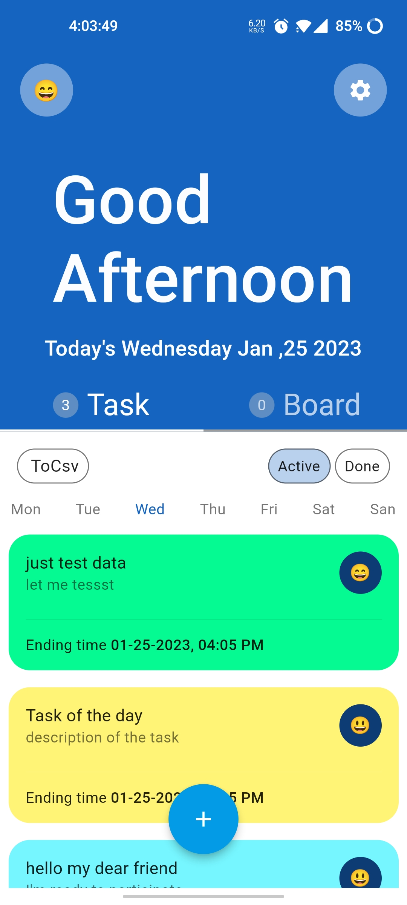
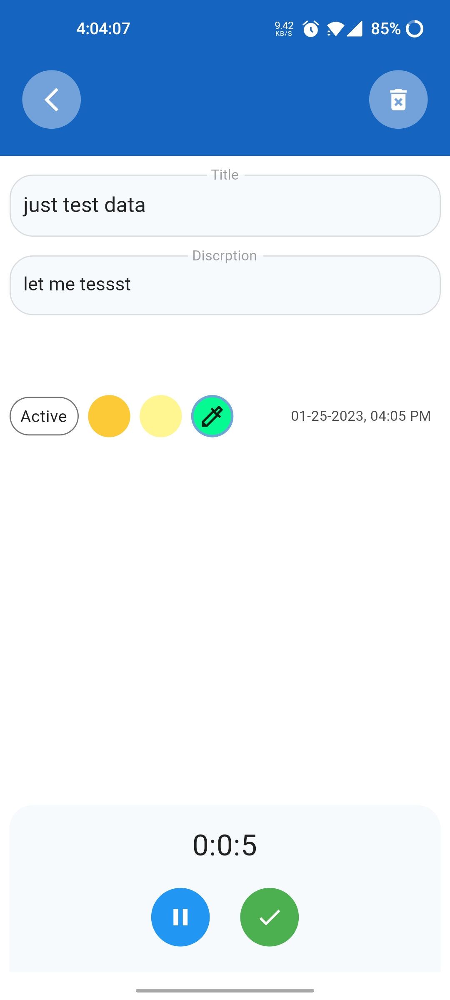
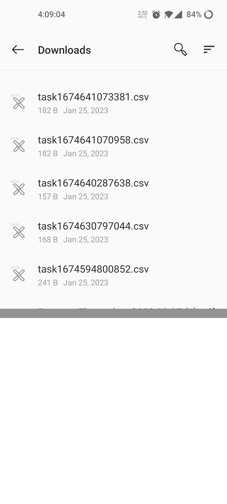

# Time-tracking-app - Fast, Robust & Secure tool
### About the project

Time-tracking-app is a cross-platform mobile tool for the time mangement. It is written in Dart using [Flutter](https://flutter.io).

# The task file [PDF](file/Take-Home_Challenge_for_Flutter_Mobile_Developer.pdf "PDF")
# APK [🔗 apk file](file/release/app-release.apk "APK")
# App preview

<p align="center">
  
  
  
  
  
  
  
  
  
  
  
  
</p>

 
## Video demo
 
<a href="https://user-images.githubusercontent.com/44582949/214555731-a6df56c5-fe0e-4721-9b33-eab956e0f6b1.mp4">Video 1</a>
------------------------------------
<a href="https://user-images.githubusercontent.com/44582949/214555744-34304953-bbe1-430b-b32c-29b81212c3a1.mp4">Video 2</a>
------------------------------------
<a href="https://user-images.githubusercontent.com/44582949/214555768-1f43125e-5af1-4c9e-b65c-95607e0d7e14.mp4">Video 3</a>
------------------------------------
<a href="https://user-images.githubusercontent.com/44582949/214569651-3b01bc50-8026-4d3a-bc74-584cec9e21c5.mp4">Video 3</a>


## Features

- **A kanban board**:  where users can create, edit, and move tasks between
different columns (e.g. "To Do", "In Progress", "Done").
- **tracking the time spent on each task**: allows users to start and stop tracking the time spent on each task.
- **A history of completed tasks**:  including the time spent on each task and the date it was completed.
- **export data to CSV**: export Tasks to CSV file
- **Custom Theme** Automatic, Light, Dark & Dark OLED Theme Options 
- **8MB - Fast & Lightweight Simple**


## Project Structure

After successful build, your application structure should look like this:

```
.
├── android                         - contains files and folders required for running the application on an Android operating system.
├── assets                          - contains all images and fonts of your application.
├── ios                             - contains files required by the application to run the dart code on iOS platforms.
├── lib                             - Most important folder in the project, used to write most of the Dart code.
    │   ├── constants               - contains all constants classes    
        ├── ....                    - other  constants 
    ├── features
    │   ├── shared                  - shared  methods 
        ├── ....                    - other  features 
    ├── l10n                        - contains localization classes
    ├── services                    - app services and database controllers
        ├── base                    - base controllers
        ├── ....                    - other services        
    ├── utils                       - contains common files and utilities of project
    ├── main.dart                   - starting point of the application

```

## Built with

- [Flutter](https://flutter.dev/) - Beautiful native apps in record time.
- [Android Studio](https://developer.android.com/studio/index.html/) - Tools for building apps on every type of Android device.
- [Xcode](https://developer.apple.com/xcode/) - Tools for building apps on every type of IOS device.
- [Visual Studio Code](https://code.visualstudio.com/) - Code editing. Redefined.

## System Requirements

Dart SDK Version 2.18.6 or greater.
Flutter SDK Version 3.0.0 or greater.

### How you can do code formatting?

- if your code is not formatted then run following command in your terminal to format code
  ```
  dart format .
  ```
## Download & install

First, clone the repository with the 'clone' command, or just download the zip.

```
$ git git@github.com:Ekmadish/time-tracking-app-home-challenge-.git
```

Then, download either Android Studio or Visual Studio Code, with their respective [Flutter editor plugins](https://flutter.io/get-started/editor/). For more information about Flutter installation procedure, check the [official install guide](https://flutter.io/get-started/install/).

Install dependencies from pubspec.yaml by running `flutter packages get` from the project root (see [using packages documentation](https://flutter.io/using-packages/#adding-a-package-dependency-to-an-app) for details and how to do this in the editor).

There you go, you can now open & edit the project. Enjoy!

## Contributing

If you want to take the time to make this project better, please read the [contributing guides](https://github.com/Ekmadish/home-challenge-time-tracking-app-/blob/master/CONTRIBUTING.md) first. Then, you can open an new [issue](https://github.com/Ekmadish/home-challenge-time-tracking-app-/issues/new), of a [pull request](https://github.com/Ekmadish/home-challenge-time-tracking-app-/compare).

## Thanks

- [Flutter](https://flutter.dev) for the great cross platform framework

## License

This project is licensed under the GNU GPL v3 License - see the [LICENSE.md](LICENSE) file for details.
